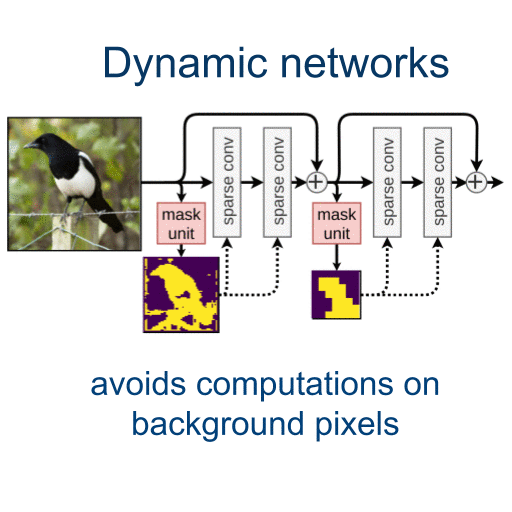

# Dynamic Convolutions - DynConv
Pytorch code for DynConv. DynConv applies convolutions on important regions of the image only, and thus reduces the computational cost while speeding up inference up to 2 times. 

[https://arxiv.org/abs/1912.03203](https://arxiv.org/abs/1912.03203)

> Dynamic Convolutions: Exploiting Spatial Sparsity for Faster Inference  
> Thomas Verelst and Tinne Tuytelaars  
> CVPR 2020  

Note that our work consists of two parts:
* a mechanism to train spatial hard-attention masks using the Gumbel-Softmax trick
* a method to efficiently execute sparse operations (currently for 3x3 depthwise convolution only)

The first point is demonstrated on both classification and human pose estimation, the second point only on human pose estimation.

## Classification
* [https://github.com/thomasverelst/dynconv/classification/](https://github.com/thomasverelst/dynconv/tree/master/classification)
* ResNet on CIFAR-10 and ImageNet (only masks, no efficient CUDA implementation for simplicity)

## Human Pose Estimation
* [https://github.com/thomasverelst/dynconv/pose/](https://github.com/thomasverelst/dynconv/tree/master/pose)
* Stacked Hourglass on MPII - with fast CUDA implementation of DynConv for depthwise convolutions of the MobileNetV2 residual block

## Coming later
* Classification with efficient sparse MobileNetV2

###### Click thumbnail for 1-minute Youtube overview video

